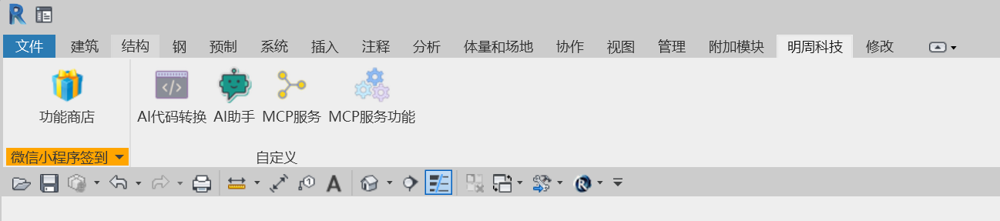

# xml.Revit.MCP 工具库概览

[English](./README.md) | [中文文档](./README-zh.md)

**xml.Revit.MCP** 提供了一套完整的工具集，用于通过 Model Context Protocol (MCP) 与 Autodesk Revit 集成。这个库作为 AI 助手与
Revit 之间的桥梁，支持强大的自动化能力以及对建筑模型的编程交互。



## 主要功能

该工具库提供了丰富的 Revit 自动化与交互功能：

### **基础操作**

- 获取 Revit 插件中可用的命令列表
- 执行指定的 Revit 命令
- 通过参数调用特定的 Revit 函数
- 获取视图数据和当前选中的元素

### **元素管理**

- 按类别查找元素
- 获取元素的参数与位置信息
- 更新元素参数
- 删除元素
- 在当前视图中显示或高亮元素
- 移动元素到新位置

### **构件创建**

- 创建标高 / 楼层
- 创建平面视图
- 创建轴网
- 创建墙体与楼板
- 创建房间与房间标签
- 创建门窗
- 创建机电构件（风管、管道、电缆桥架）
- 创建族实例
- 链接 DWG 文件
- 创建图纸视图

## 安装要求

- **xml.Revit**：版本 1.3.4.3 或更高
- **Python**：版本 3.10 或更高
- **UV 包管理器**：用于包安装
- **Revit**：支持 2019 至 2024 版本（需安装插件）

## 安装步骤

1. 安装 UV 包管理器：

   ```bash
   pip install uv
   ```

2. 安装 revit-mcp 包：

   ```bash
   pip install revit-mcp
   ```

3. 测试安装结果：
   ```bash
   uvx revit-mcp
   ```
   若看到如下提示说明启动成功：
   ```
   RevitMCPServer - INFO - Successfully connected to Revit on startup
   ```

## 与 AI 助手集成

### Claude for Desktop

编辑 `claude_desktop_config.json`

### Cursor

编辑 `mcp.json`

### Cline

编辑 `cline_mcp_setting.json`

添加以下内容：

```json
{
  "mcpServers": {
    "RevitMCPServer": {
      "disabled": false,
      "timeout": 30,
      "command": "uvx",
      "args": ["revit-mcp"],
      "transportType": "stdio",
      "autoApprove": [
        "active_view",
        "call_func",
        "create_cable_trays",
        "create_door_windows",
        "create_ducts",
        "create_family_instances",
        "create_floors",
        "create_floor_plan_views",
        "create_grids",
        "create_levels",
        "create_pipes",
        "create_room_separation_lines",
        "create_room_tags",
        "create_rooms",
        "create_sheets",
        "create_walls",
        "delete_elements",
        "execute_commands",
        "find_elements",
        "get_commands",
        "get_locations",
        "get_selected_elements",
        "get_view_data",
        "link_dwg_and_activate_view",
        "move_elements",
        "parameter_elements",
        "show_elements",
        "update_elements"
      ]
    }
  }
}
```

## 扩展功能开发

你可以通过自定义 MCP DLL 文件来扩展功能：

1. 实现接口 `xml.Revit.MCP.Public.IMCPMethod`
2. 遵循 JSON-RPC 2.0 协议进行通信
3. 编译成 DLL 文件并放入 MCP 指定文件夹

## 插件配置说明

使用 `revit-mcp-plugin` 插件时：

1. 在 Revit 中注册该插件
2. 通过 **Add-in Modules → Revit MCP Plugin → Settings** 配置命令
3. 启用服务：**Add-in → Revit MCP Plugin → Revit MCP Switch**

启用后，AI 助手即可发现并控制你的 Revit 程序，执行由 `xml.Revit.MCP` 工具库提供的各种自动化命令。
